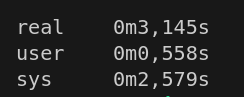

# Блок-схемы:

## Алгоритмы работы основной программы:

### Lab4a:


### Lab4b:


## Алгоритмы работы функций по обработке строк:

### lineUtils.c

#### deleteSpaces


#### deleteDuplicates


#### deleteDuplicateSymbols


### mystring.c

#### myStrlen


#### myStrtok


#### myStrcpy


# Сравнительный анализ времени на тестовом файле testfiles/test2.txt:

## lab4a:


## lab4b:


## Пользовавание программой:

Перед началом пользование необходимо установить библиотеку GNU readline

Для Ubuntu:
```
sudo apt install libreadline-dev
```
Для Mac:
```
brew install readline
```
или
```
sudo port install readline
```

## Команды Makefile:

### make
Выполнит цель build

### make build
Соберёт файлы lab4a.c, lab4b.c в исполняемые файлы lab4a, lab4b

### make clear 
Очистит папку от лишних файлов

### make test
Выполнит цель build и запустит файлы lab4a, lab4b, перенаправив вход из тестового файла testfiles/test1.txt

### make valgring
Сделает то же самое, что и цель test, но запустит это в valgrind

### make time
Запустит тест программ с файлом testfiles/test2.txt и запустит команду time, которая выведет время выполнения обеих программ

## Структура проекта:

### /img
Блок-схемы алгоритмов программы

### /lineUtils
Функции для обработки строк: Удаление лишних пробелов, Удаление повторяющихся символов в словах

### /main
Мейн файлы лабораторных работ

### /mystring
Функции, переписанные за место библиотечных функций <string.h>

### /task
Скриншоты самой лабораторной работы

### /testfiles
Тестовые файлы

## Неочевидные места в коде:

### bool mode
Данная переменная встречается в коде файла lineUtils.c
Она принимает значение либо true, либо false
Если значение true, мы используем самописные функции, а если false, то библиотечные. Этим различаются выполнения lab4a и lab4b. 

### getchar()
```c
int c = getchar();
if (c != '\n') {
    ungetc(c, stdin);
}
```
Эта конструкция встречается в lab4b.c
В описании работы написано, что нельзя использовать getchar и подобные функции для ввода строк. В данном случае мы используем их для обработки краевого случая, когда на вход подаётся пустая строка без каких-либо символов. Мы проверяем последний элемент буффера на '\n', именно это индикатор пустой строки. Если это не так, мы возвращаем последний элемент обратно. Так что мы не используем эти функции для ввода.