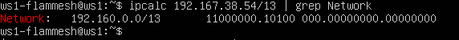
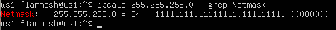
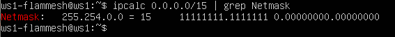
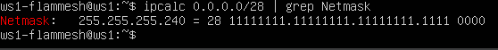
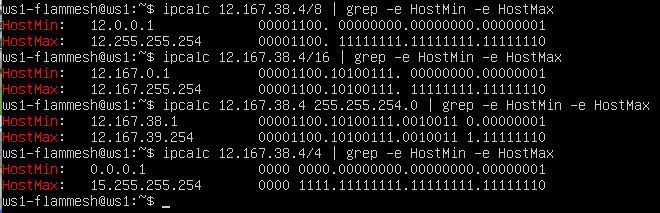
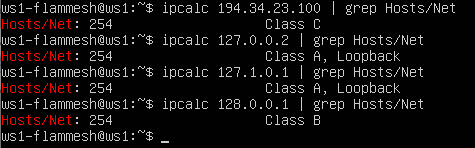
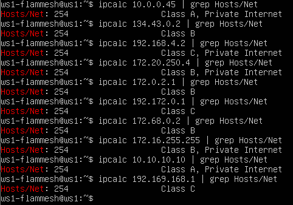
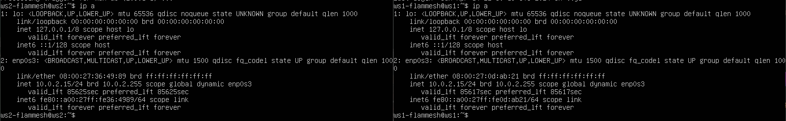
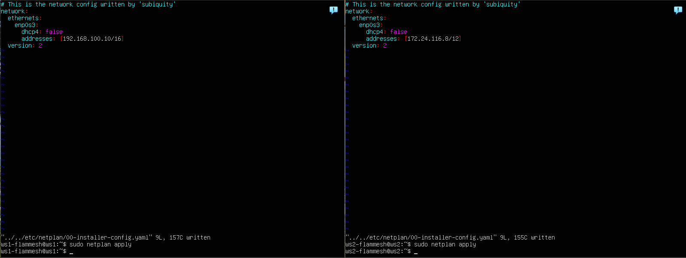

## Part 1. Инструмент ipcalc

### 1.1. Сети и маски

1) Адрес сети 192.167.38.54/13<br>
    - ```192.160.0.0```<br>
    


2) Перевод маски 255.255.255.0 в префиксную и двоичную запись, /15 в обычную и двоичную, 11111111.11111111.11111111.11110000 в обычную и префиксную<br> 
    - ```255.255.255.0 в префиксной: /24 ```<br> 
    ```255.255.255.0 в двоичной: 11111111.11111111.11111111.00000000```<br>
    <br>
    - ```/15 в обычной: 255.254.0.0```<br>
    ```/15 в двоичной: 11111111.11111110.00000000.00000000```<br>
    <br>
    - ```11111111.11111111.11111111.11110000 в обычной: 255.255.255.240```<br>
    ```11111111.11111111.11111111.11110000 в префиксной: /28 ```<br>
    <br>

3) Минимальный и максимальный хост в сети 12.167.38.4 при масках: /8, 11111111.11111111.00000000.00000000, 255.255.254.0 и /4<br> 

    - ```Минимальные и максимальные хосты по заданным маскам ```<br>
    <br>

### 1.2. localhost

- Определи и запиши в отчёт, можно ли обратиться к приложению, работающему на localhost, со следующими IP: 194.34.23.100, 127.0.0.2, 127.1.0.1, 128.0.0.1<br>

<br>
- 194.34.23.100, 128.0.0.1 - Нет
- 127.0.0.2, 127.1.0.1 - Да, Loopback

### 1.3. Диапазоны и сегменты сетей

1) Какие из перечисленных IP можно использовать в качестве публичного, а какие только в качестве частных: <br>
    <br>
    - Частные:
        - 10.0.0.45
        - 192.168.4.2
        - 172.20.250.4
        - 172.16.255.255
        - 10.10.10.10
    - Публичные:
        - 134.43.0.2
        - 172.0.2.1
        - 192.172.0.1
        - 172.68.0.2
        - 192.169.168.1

2) Какие из перечисленных IP адресов шлюза возможны у сети 10.10.0.0/18: <br>
    - Возможны:
        - 10.10.0.2, 10.10.10.10, 10.10.1.255
    - Не возможны:
        - 10.0.0.1, 10.10.100.1
<!-- 
## Part 2. Статическая маршрутизация между двумя машинами

- ```ip a (ws1, ws2)```<br>
<br>


- ```Описан сетевой интерфейс, соответствующий внутренней сети, на обеих машинах и заданы следующие адреса и маски: ws1 - 192.168.100.10, маска /16, ws2 - 172.24.116.8, маска /12```<br>
<br>


- ```netplan apply```<br>
<br>

### 2.1. Добавление статического маршрута вручную


- ```Команды для добаления статического маршрута, пинг```<br>
<br>

### 2.2. Добавление статического маршрута с сохранением

- ```Изменённые файлы etc/netplan/00-installer-config.yaml```<br>
<br>

- ```Пропинговали ещё раз```<br>
<br>

## Part 3. Утилита iperf3

### 3.1. Скорость соединения

- 8 Mbps = 1 MB/s<br>
- 100 MB/s = 819200 Kbps<br>
- 1 Gbps = 1024 Mbps<br>

### 3.2. Утилита iperf3

- ```Скорость соединения между ws1 и ws2```<br>
<br>

## Part 4. Сетевой экран

### 4.1. Утилита iptables

- ```Правила в /etc/firewall.sh```<br>
<br>

- ```Запуска файлов на обеих машинах```<br>
<br>
- Если сначала стоит запрещающее правило, то оно имеет приоритет перед последующим разрешающим.


### 4.2. Утилита nmap

- ```Ping + nmap```<br>
<br>

## Part 5. Статическая маршрутизация сети

### Cкрины с содержанием файла etc/netplan/00-installer-config.yaml для каждой машины:
- ```WS11```<br>
<br>

- ```R1```<br>
<br>

- ```WS21```<br>
<br>

- ```WS22```<br>
<br>

- ```R2```<br>
<br>

### Если ошибок нет, то командой ip -4 a проверить, что адрес машины задан верно.

- ```WS11```<br>
<br>

- ```R1```<br>
<br>

- ```WS21```<br>
<br>

- ```WS22```<br>
<br>

- ```R2```<br>
<br>

### Пропинговать ws22 с ws21. Аналогично пропинговать r1 с ws11.

- ```WS22 c WS21```<br>
<br>

- ```R1 c WS11```<br>
<br>

### 5.2. Включение переадресации IP-адресов.
- ```sysctl -w net.ipv4.ip_forward=1 на роутерах```<br>
<br>

- ```net.ipv4.ip_forward=1 в /etc/sysctl.conf на роутерах```<br>
<br>

### 5.3. Установка маршрута по-умолчанию

Скрины etc/netplan/00-installer-config.yaml:<br>
- ```WS11 netplan```<br>
<br>

- ```WS21 netplan```<br>
<br>

- ```WS22 netplan```<br>
<br>

- ```Скрин выполнения команды ip r```<br>
<br>

- ```Пропинговали r2 с ws11```<br>
<br>

### 5.4. Добавление статических маршрутов

- ```netplan роутеров:```<br>
<br>

- ```Маршруты роутеров: (ip r)```<br>
<br>

- ```ip r list 10.10.0.0/[маска сети] и ip r list 0.0.0.0/0```<br>
<br>

- Для адреса 10.10.0.0/18 был выбран маршрут, отличный от 0.0.0.0/0, потому что при наличии нескольких маршрутов одинаковой длины выбирается тот маршрут, который задан наиболее точно.

### 5.5. Построение списка маршрутизаторов

- ```Вывод команд traceroute и tcpdump```<br>
<br>

Утилита Traceroute вместо ICMP-запроса отправляет 3 UDP-пакета на определенный порт целевого хоста и ожидает ответа о недоступности этого порта. Первый пакет отправляется с TTL=1, второй с TTL=2 и так далее, пока запрос не попадёт адресату. Так как вместо ICMP-запроса он отправляет UDP-запрос, в каждом запросе есть порт отправителя и порт получателя. По умолчанию запрос отправляется на закрытый порт 34434. Когда запрос попадёт на хост назначения, этот хост отправит ответ о недоступности порта «Destination port unreachable» (порт назначения недоступен). Это значит, что адресат получил запрос. Traceroute воспримет этот ответ как завершение трассировки.

### 5.6. Использование протокола ICMP при маршрутизации

- ```Пинг несуществующего ip, дамп с r1```<br>
<br>

## Part 6. Динамическая настройка IP с помощью DHCP

- ```1) указать адрес маршрутизатора по-умолчанию, DNS-сервер и адрес внутренней сети. Пример файла для r2:```<br>
<br>

- ```2) в файле resolv.conf прописать nameserver 8.8.8.8.```<br>
<br>

- ```Рестарт isc-dhcp-server```<br>
<br>

- ```После перезагрузки посмотрели, что адрес получили```<br>
<br>

- ```Пропинговали ws22 с ws21```<br>
<br>

- ```Измненный netplan ws11```<br>
<br>

- ```Настройка dhcpd.conf для r1```<br>
<br>

- ```Рестарт isc-dhcp-server для r1```<br>
<br>

- ```WS11 ip a после перезагрузки получили ip```<br>
<br>


- ```Запрос обновления ip```<br>
<br>
- ```ip WS21 до обновления```<br>
<br>
- ```ip WS21 после обновления```<br>
<br>

## Part 7. NAT

- ```В файле /etc/apache2/ports.conf на ws22 и r1 изменили строку Listen 80 на Listen 0.0.0.0:80, то есть сделали сервер Apache2 общедоступным```<br>
<br>

- ```Запуск серверов Apache2```<br>
<br>

- ```Пинг с ws22 до r1 не удаётся```<br>
<br>

- ```Успешно пропинговались с ws22 до r1 после разрешения маршрутизации icmp на r2```<br>
<br>

- ```Изменённый firewall.sh на r2```<br>
<br>

- ```Подключились с ws22 к серверу Apache на r1```<br>
<br>

- ```Подключились с r1 к серверу Apache на ws22```<br>
<br>

## Part 8. Дополнительно. Знакомство с SSH Tunnels

- ```Запустить на r2 фаервол с правилами из Части 7```<br> 
<br>

- ```Запустить веб-сервер Apache на ws22 только на localhost (то есть в файле /etc/apache2/ports.conf изменить строку Listen 80 на Listen localhost:80)```<br> 
<br>

- ```Воспользоваться Local TCP forwarding с ws21 до ws22, чтобы получить доступ к веб-серверу на ws22 с ws21```<br>
<br>

- ```Воспользоваться Remote TCP forwarding c ws11 до ws22, чтобы получить доступ к веб-серверу на ws22 с ws11 (прописываем именно с ws22)```<br>
<br>


- ```Подключились к серверу с ws21 до ws22```<br> 
<br>

- ```Подключились к серверу с ws11 до ws22```<br> 
<br> -->
